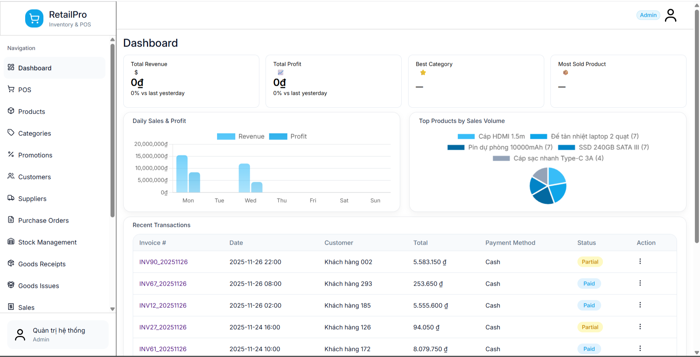
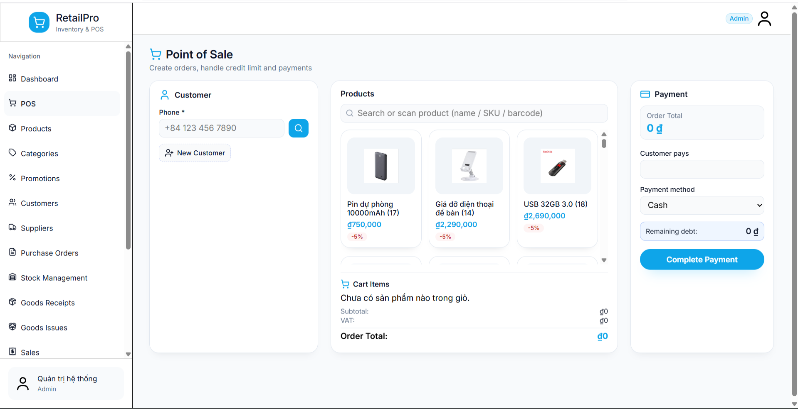
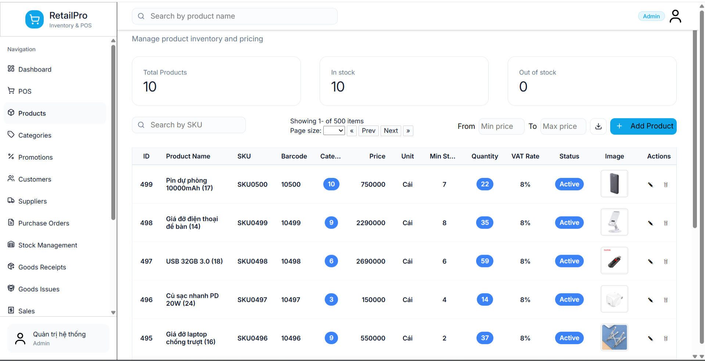
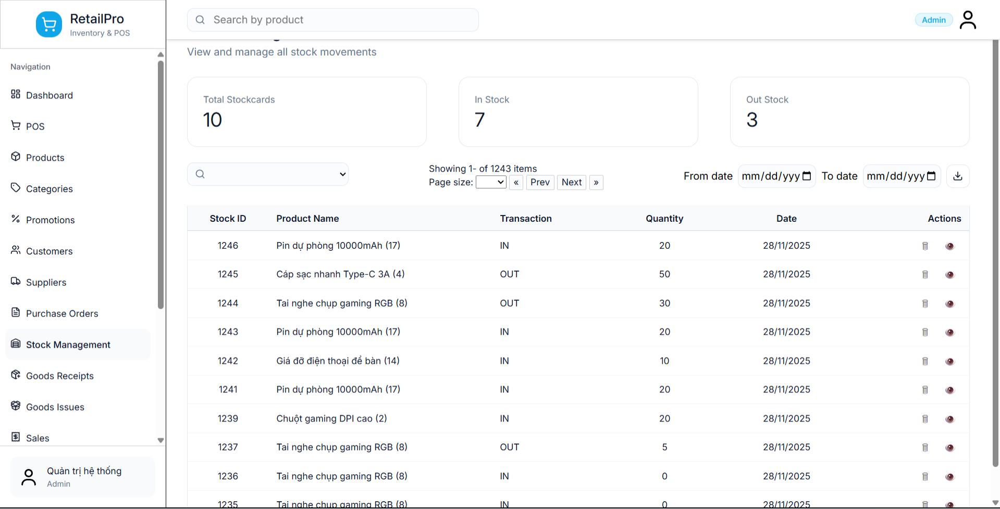
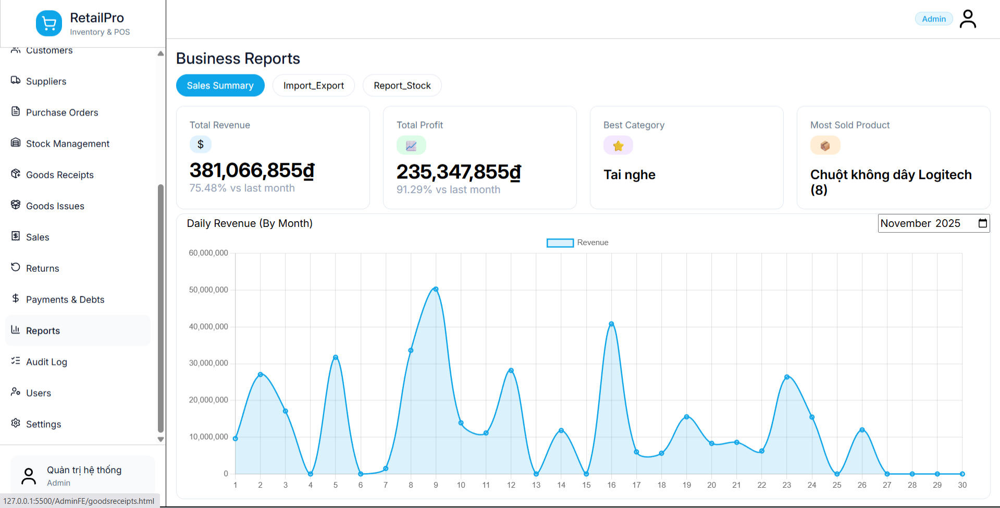
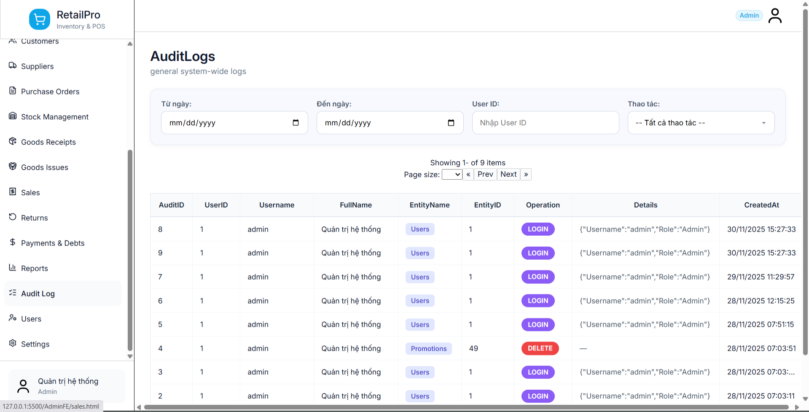

# 🏪 Retail POS & Inventory Management System

A full-featured Retail POS (Point of Sale) and Inventory Management System developed using ASP.NET Core Web API, SQL Server, HTML, CSS and JavaScript.

This project was developed as a Software Development course project at Hung Yen University of Technology and Education.

---

# 📋 Project Overview

The system helps retail stores manage daily business operations including:

* Point Of Sale (POS)
* Product Management
* Category Management
* Promotion Management
* Customer Management
* Supplier Management
* Purchase Orders
* Stock Management
* Goods Receipts
* Goods Issues
* Sales Management
* Returns Management
* Payments & Debts Tracking
* Business Reports
* Audit Logging
* User & Role Management

---

# 🚀 Technology Stack

## Backend

* ASP.NET Core Web API
* Entity Framework Core
* SQL Server
* RESTful API

## Frontend

* HTML5
* CSS3
* JavaScript

## Tools

* Visual Studio
* SQL Server Management Studio
* Git & GitHub
* Postman

---

# ✨ Key Features

### POS System

* Create sales orders
* Product search
* Customer lookup
* Payment processing
* Debt management

### Inventory Management

* Manage product stock
* Track inventory movement
* Goods receipts
* Goods issues

### Product Management

* Product catalog
* Categories
* Promotions
* Pricing management

### Business Management

* Customer management
* Supplier management
* Purchase orders
* Returns management

### Reporting & Security

* Revenue reports
* Profit reports
* Inventory reports
* Audit logs
* User management

---

# 📸 System Screenshots

## Dashboard

Business overview including revenue, profit, top-selling products and recent transactions.

---

## Point Of Sale (POS)

Sales screen for creating invoices and processing customer payments.

---

## Product Management

Manage products, pricing, VAT, stock quantity and product information.

---

## Inventory Management

Track inventory movement, stock in/out transactions and warehouse activities.

---

## Business Reports

Revenue analytics, profit statistics and inventory reports.

---

## Audit Logging

Track user activities and system operations for monitoring and security purposes.

---

# 🏗 Architecture

The project follows a layered architecture:

* Frontend
* Gateway API
* Core API
* User API
* Admin API
* Business Logic Layer (BLL)
* Data Access Layer (DAL)
* SQL Server Database

---

# 👨‍💻 My Responsibilities

As Team Leader and Backend Developer, I participated in:

* Database design
* API development
* Business logic implementation
* Authentication & authorization
* Inventory management modules
* Audit logging implementation
* Team coordination

---

# 📈 Project Highlights

* 200+ commits
* Multi-module architecture
* RESTful API development
* Inventory tracking workflow
* Audit logging system
* Reporting and analytics dashboard

---

# 🎓 Academic Information

Software Development Course Project

Hung Yen University of Technology and Education

Bachelor of Information Technology (Software Engineering)

---

# 📬 Contact

**Pham Xuan Chuan**

* Email: [phamchuan2608@gmail.com](mailto:phamchuan2608@gmail.com)
* LinkedIn: https://linkedin.com/in/phamxuanchuan
* GitHub: https://github.com/pJuan2005
